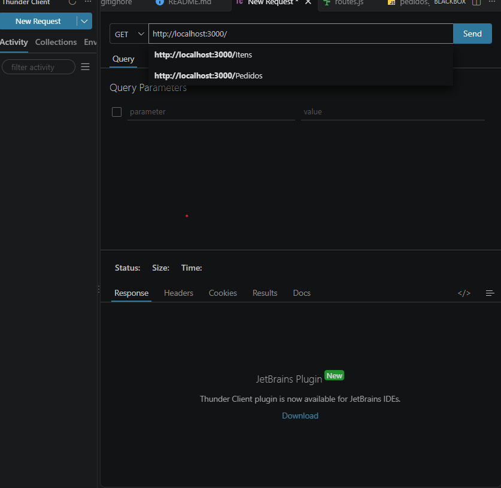
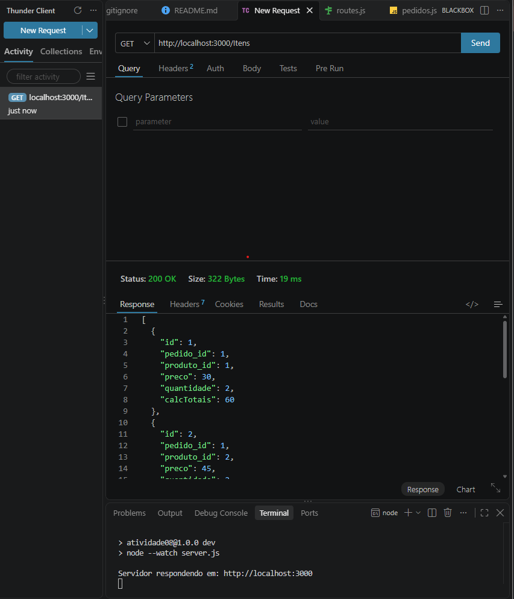
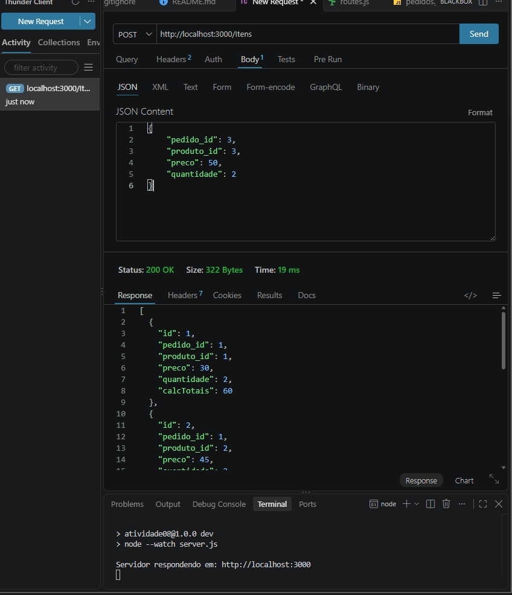
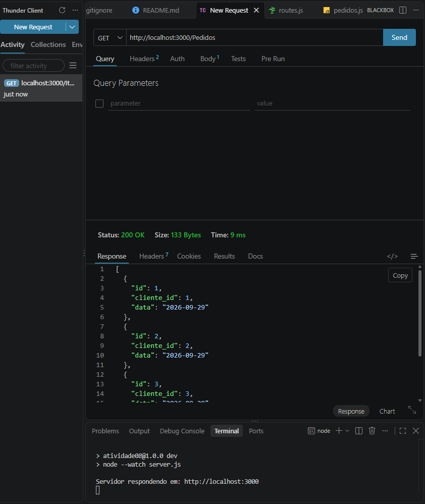

Claro. Vou deixar o `README.md` mais simples e acadêmico, **sem emojis**, usando títulos com `##`, blocos de código e a estrutura mais limpa.

 README.md

# Atividade 08 - API de Pedidos

 Projeto desenvolvido em Node.js utilizando Express, com organização baseada no padrão MVC.

 A aplicação possui funcionalidades relacionadas a pedidos e itens, utilizando arquivos JSON para armazenamento dos dados e o Thunder Client para realização dos testes.

 ## Estrutura do projeto

```
atividade08/
│
├── dados/
│   ├── itens.json
│   └── pedidos.json
│
├── node_modules/
│
├── src/
│   ├── routes.js
│   └── controllers/
│       ├── itens.js
│       └── pedidos.js
│
├── server.js
├── package.json
└── README.md
```

 ## Descrição dos arquivos

 `dados/`

 Pasta responsável por armazenar os arquivos JSON utilizados pela aplicação.

 `dados/itens.json`

 Armazena os itens relacionados aos pedidos.

 `dados/pedidos.json`

 Armazena os pedidos cadastrados.

 `node_modules/`

 Pasta criada pelo npm para armazenar as dependências utilizadas pelo projeto.

 `src/routes.js`

 Responsável por definir as rotas da aplicação.

 `src/controllers/itens.js`

 Responsável pelas operações relacionadas aos itens.

 `src/controllers/pedidos.js`

 Responsável pelas operações relacionadas aos pedidos.

 `server.js`

 Responsável por configurar e iniciar o servidor.

 `package.json`

 Contém as informações do projeto, scripts e dependências.

 ## Tecnologias utilizadas

 - Node.js
- Express
- CORS
- JSON
- Thunder Client
- Visual Studio Code

 ## Instalação

 É necessário ter o Node.js instalado no computador.

 Para verificar a instalação, execute no terminal:

```
node -v
```

 Depois:

```
npm -v
```

 Após confirmar que o Node.js está instalado, abra a pasta do projeto no Visual Studio Code.

 Execute:

```
npm install
```

 Esse comando instala as dependências definidas no arquivo `package.json`.

 ## package.json

 O arquivo `package.json` utilizado no projeto é:

```
{
  "name": "atividade08",
  "version": "1.0.0",
  "main": "server.js",
  "scripts": {
    "dev": "node --watch server.js",
    "test": "echo \"Error: no test specified\" && exit 1",
    "start": "node server.js"
  },
  "keywords": [],
  "author": "Samuka9191",
  "license": "ISC",
  "description": "",
  "dependencies": {
    "cors": "^2.8.6",
    "express": "^5.2.1"
  }
}
```

 ## Executando o projeto

 Para iniciar o projeto em modo de desenvolvimento, utilize:

```
npm run dev
```

 Também é possível iniciar normalmente utilizando:

```
npm start
```

 Ao iniciar o servidor, deverá aparecer no terminal:

```
Servidor respondendo em: http://localhost:3000
```

 ## Print do servidor

 Coloque abaixo o print do terminal mostrando o servidor funcionando.

```
[ INSIRA O PRINT AQUI ]
```

 ## server.js

 O arquivo `server.js` é responsável por iniciar o servidor e configurar o Express.

```
const express = require("express")
const cors = require("cors")

const routes = require("./src/routes")

const app = express()

app.use(cors())
app.use(express.urlencoded({ extended: true }))
app.use(express.json())

app.use(routes)

const porta = 3000

app.listen(porta, () => {
    console.log(`Servidor respondendo em: http://localhost:${porta}`)
})
```

 A aplicação utiliza a porta `3000`.

 O endereço do servidor é:

```
http://localhost:3000
```

 ## Dados

 Os dados utilizados pela aplicação estão armazenados dentro da pasta `dados`.

 A pasta possui dois arquivos:

```
dados/
├── itens.json
└── pedidos.json
```

 ## pedidos.json

 O arquivo `pedidos.json` possui os seguintes dados:

```
[
    {
        "id": 1,
        "cliente_id": 1,
        "data": "2026-09-29"
    },
    {
        "id": 2,
        "cliente_id": 2,
        "data": "2026-09-29"
    },
    {
        "id": 3,
        "cliente_id": 3,
        "data": "2026-09-29"
    }
]
```

 ## itens.json

 O arquivo `itens.json` possui os seguintes dados:

```
[
    {
        "id": 1,
        "pedido_id": 1,
        "produto_id": 1,
        "preco": 30,
        "quantidade": 2
    },
    {
        "id": 2,
        "pedido_id": 1,
        "produto_id": 2,
        "preco": 45,
        "quantidade": 2
    },
    {
        "id": 3,
        "pedido_id": 2,
        "produto_id": 1,
        "preco": 30,
        "quantidade": 1
    },
    {
        "id": 4,
        "pedido_id": 3,
        "produto_id": 2,
        "preco": 45,
        "quantidade": 3
    }
]
```

 ## routes.js

 O arquivo `src/routes.js` é responsável pelas rotas da aplicação.

```
const express = require("express")
const router = express.Router()

const Pedido = require("./controllers/pedidos")
const Itens = require("./controllers/itens")

const rotaInicial = (req, res) => {
    res.json("Pedidos MVC respondendo")
}

router.get('/', rotaInicial)

router.post('/itens', Itens.criar)
router.get('/itens', Itens.listar)
router.put('/itens/:id', Itens.alterar)
router.delete('/itens/:id', Itens.excluir)

router.post('/pedidos', Pedido.criar)
router.get('/pedidos', Pedido.listar)
router.put('/pedidos/:id', Pedido.alterar)
router.delete('/pedidos/:id', Pedido.excluir)

module.exports = router
```

 ## Rotas da aplicação

 | Método | Rota | Função |
| --- | --- | --- |
| GET | `/` | Verificar o funcionamento da API |
| POST | `/itens` | Criar um item |
| GET | `/itens` | Listar os itens |
| PUT | `/itens/:id` | Alterar um item |
| DELETE | `/itens/:id` | Excluir um item |
| POST | `/pedidos` | Criar um pedido |
| GET | `/pedidos` | Listar os pedidos |
| PUT | `/pedidos/:id` | Alterar um pedido |
| DELETE | `/pedidos/:id` | Excluir um pedido |

## Controller de pedidos

 O arquivo `src/controllers/pedidos.js` é responsável pelas operações relacionadas aos pedidos.

```
const pedidos = require("../../dados/pedidos.json")

const criar = (req, res) => {
    const dados = req.body
    dados.id = Number(pedidos[pedidos.length - 1].id) + 1
    pedidos.push(dados)
    res.status(201).json(dados)
}

const listar = (req, res) => {
    res.json(pedidos)
}

const alterar = (req, res) => {
    res.json("Em construção")
}

const excluir = (req, res) => {
    res.json("Em construção")
}

module.exports = {
    criar,
    listar,
    alterar,
    excluir
}
```

 As funções `criar` e `listar` estão implementadas.

 As funções `alterar` e `excluir` ainda estão em construção.

 ## Controller de itens

 O arquivo `src/controllers/itens.js` é responsável pelas operações relacionadas aos itens.

```
const itens = require("../../dados/itens.json")

function subotais() {
    itens.forEach(p => {
        p.calcTotais = p.quantidade * p.preco
    })
}

const criar = (req, res) => {
    const dados = req.body
    dados.id = Number(itens[itens.length - 1].id) + 1
    res.status(201).json(dados)
}

const listar = (req, res) => {
    subotais()
    res.json(itens)
}

const alterar = (req, res) => {
    res.json("Em construção")
}

const excluir = (req, res) => {
    res.json("Em construção")
}

module.exports = {
    criar,
    listar,
    alterar,
    excluir
}
```

 A função `subotais()` calcula o valor total de cada item utilizando:

```
quantidade * preco
```

 Com os dados atuais, os valores calculados são:

```
Item 1: 30 * 2 = 60
Item 2: 45 * 2 = 90
Item 3: 30 * 1 = 30
Item 4: 45 * 3 = 135
```

 ## Testando com Thunder Client

 Para realizar os testes da API, foi utilizado o Thunder Client no Visual Studio Code.

 Primeiramente, deve-se instalar a extensão Thunder Client.

 Depois de instalar, abra o Thunder Client pelo menu lateral do Visual Studio Code.

 ## Teste da rota inicial

 Para verificar se o servidor está funcionando, crie uma nova requisição no Thunder Client.

 Método:

```
GET
```

 URL:

```
http://localhost:3000/
```

 Clique em `Send`.

 A resposta esperada é:

```
"Pedidos MVC respondendo"
```

 ## Print da rota inicial

```

```

 ## Teste para listar os itens

 Para listar os itens cadastrados, utilize:

```
GET http://localhost:3000/itens
```

 Clique em `Send`.

 A resposta deverá apresentar os itens cadastrados no arquivo `itens.json`.

 Além dos dados originais, será adicionado o campo `calcTotais`.

 Exemplo:

```
[
    {
        "id": 1,
        "pedido_id": 1,
        "produto_id": 1,
        "preco": 30,
        "quantidade": 2,
        "calcTotais": 60
    }
]
```

 ## Print do GET de itens

```

```

 ## Teste para criar um item

 Para criar um novo item, utilize:

```
POST http://localhost:3000/itens
```

 No Thunder Client, selecione `Body` e depois `JSON`.

 Utilize um exemplo como:

```
{
    "pedido_id": 3,
    "produto_id": 3,
    "preco": 50,
    "quantidade": 2
}
```

 Depois clique em `Send`.

 A resposta deverá apresentar os dados enviados com um novo `id`.

 ## Print do POST de itens

```

```

 ## Teste para listar os pedidos

 Para listar os pedidos, utilize:

```
GET http://localhost:3000/pedidos
```

 Clique em `Send`.

 A API deverá retornar os dados existentes no arquivo `pedidos.json`.

 ## Print do GET de pedidos

```

```

 ## Teste para criar um pedido

 Para criar um novo pedido, utilize:

```
POST http://localhost:3000/pedidos
```

 No Thunder Client, selecione `Body` e depois `JSON`.

 Utilize:

```
{
    "cliente_id": 4,
    "data": "2026-10-06"
}
```

 Depois clique em `Send`.

 O controller irá gerar automaticamente o próximo `id`.

 ## Print do POST de pedidos

```
[ INSIRA O PRINT DO THUNDER CLIENT AQUI ]
```

 ## Teste de alteração de item

 A rota para alteração de um item é:

```
PUT http://localhost:3000/itens/1
```

 Atualmente, essa funcionalidade ainda está em construção.

 A resposta será:

```
Em construção
```

 ## Print do PUT de itens

```
[ INSIRA O PRINT DO THUNDER CLIENT AQUI ]
```

 ## Teste de exclusão de item

 A rota para excluir um item é:

```
DELETE http://localhost:3000/itens/1
```

 Atualmente, essa funcionalidade ainda está em construção.

 A resposta será:

```
Em construção
```

 ## Print do DELETE de itens

```
[ INSIRA O PRINT DO THUNDER CLIENT AQUI ]
```

 ## Teste de alteração de pedido

 A rota para alteração de um pedido é:

```
PUT http://localhost:3000/pedidos/1
```

 Atualmente, essa funcionalidade ainda está em construção.

 A resposta será:

```
Em construção
```

 ## Print do PUT de pedidos

```
[ INSIRA O PRINT DO THUNDER CLIENT AQUI ]
```

 ## Teste de exclusão de pedido

 A rota para excluir um pedido é:

```
DELETE http://localhost:3000/pedidos/1
```

 Atualmente, essa funcionalidade ainda está em construção.

 A resposta será:

```
Em construção
```

 ## Print do DELETE de pedidos

```
[ INSIRA O PRINT DO THUNDER CLIENT AQUI ]
```

 ## Resumo

 | Operação | Método | Endpoint | Situação |
| --- | --- | --- | --- |
| Rota inicial | GET | `/` | Funcionando |
| Listar itens | GET | `/itens` | Funcionando |
| Criar item | POST | `/itens` | Funcionando |
| Alterar item | PUT | `/itens/:id` | Em construção |
| Excluir item | DELETE | `/itens/:id` | Em construção |
| Listar pedidos | GET | `/pedidos` | Funcionando |
| Criar pedido | POST | `/pedidos` | Funcionando |
| Alterar pedido | PUT | `/pedidos/:id` | Em construção |
| Excluir pedido | DELETE | `/pedidos/:id` | Em construção |

## Funcionamento da aplicação

 O fluxo da aplicação pode ser representado da seguinte forma:

```
Thunder Client
      |
      v
  server.js
      |
      v
  routes.js
      |
      +-------------------+
      |                   |
      v                   v
  itens.js           pedidos.js
      |                   |
      v                   v
 itens.json          pedidos.json
```

 O Thunder Client envia uma requisição para o servidor.

 O `server.js` recebe a requisição e utiliza as rotas definidas em `routes.js`.

 O arquivo `routes.js` direciona a requisição para o controller correspondente.

 Os controllers `itens.js` e `pedidos.js` realizam as operações sobre os dados dos arquivos JSON.

 ## Conclusão

 O projeto consiste em uma API desenvolvida utilizando Node.js e Express.

 A aplicação foi organizada utilizando rotas e controllers, seguindo uma estrutura baseada no padrão MVC.

 Os dados são armazenados nos arquivos:

```
dados/itens.json
dados/pedidos.json
```

 A API permite consultar e criar itens e pedidos. As operações de alteração e exclusão já possuem suas respectivas rotas e controllers, porém ainda estão em construção.

 Os testes das rotas foram realizados utilizando o Thunder Client.
